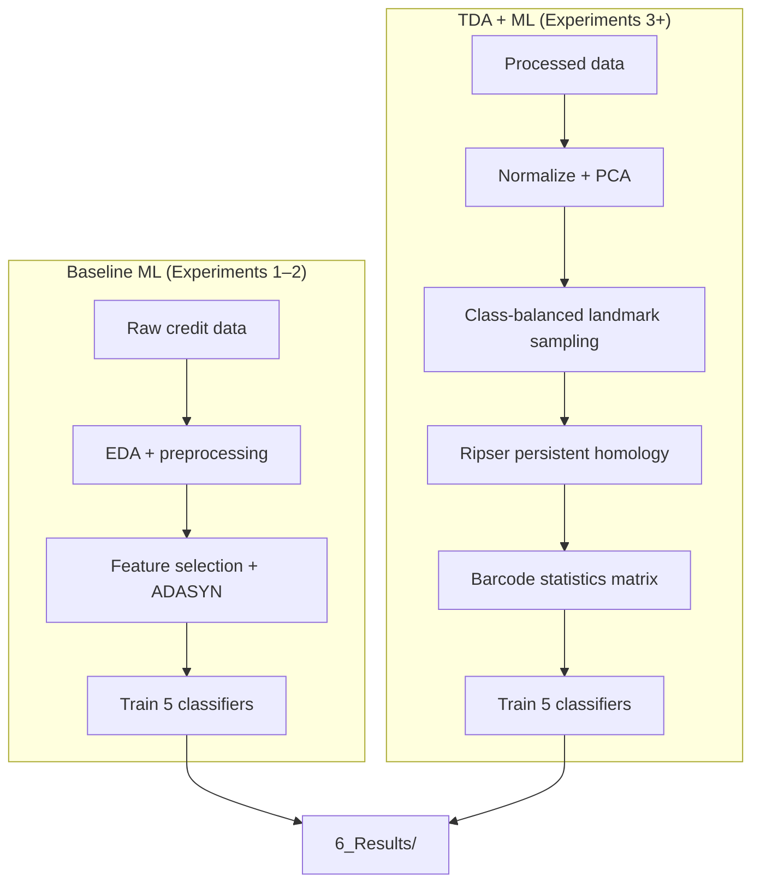

# Enhancing Loan Default Prediction Using Topological Data Analysis

Research codebase for investigating whether **Topological Data Analysis (TDA)**—specifically **persistent homology barcode statistics**—can improve credit default prediction compared to classical machine learning on raw tabular features.

The project compares baseline classifiers trained on original credit datasets against the same classifiers trained on TDA-derived feature matrices, across two public UCI datasets and a suite of controlled experiments (paper + exploratory + new methodology/statistics). Results feed into the thesis/paper *Enhancing Loan Default Prediction Using Topological Data Analysis* (`7_Paper/`).

---

## Table of Contents

- [Overview](#overview)
- [Research Questions](#research-questions)
- [Datasets](#datasets)
- [Methodology](#methodology)
- [Repository Structure](#repository-structure)
- [Experiments](#experiments)
- [New Methodology & Statistics Experiments (23–27)](#new-methodology--statistics-experiments-2327)
- [Machine Learning Setup](#machine-learning-setup)
- [Getting Started](#getting-started)
- [Running Experiments](#running-experiments)
- [Results and Paper Outputs](#results-and-paper-outputs)
- [Documentation for the Team](#documentation-for-the-team)
- [Core Utilities (`utils.py`)](#core-utilities-utilspy)
- [Known Issues](#known-issues)
- [What Is Not Tracked in Git](#what-is-not-tracked-in-git)

---

## Overview

Credit default prediction is typically approached as supervised classification on engineered tabular features. This project adds a **topological feature engineering stage**:

1. Reduce and normalize the original dataset (PCA).
2. Sample **landmark subsets** from each class.
3. Compute **persistence diagrams** with Ripser.
4. Summarize each diagram into **12 barcode statistics** per homology dimension (H₀, H₁).
5. Train standard ML classifiers on the resulting barcode feature matrix.

The pipeline is implemented in **`utils.py`** (~2,500 lines) and orchestrated through numbered folders under **`5_Experiments/`**. Aggregated metrics and LaTeX tables are produced in **`6_Results/`**.



---

## Research Questions

The experiments systematically address:

| Theme | Question |
|-------|----------|
| **Baseline comparison** | How do default vs. tuned ML models perform on original features? (Exp 1–2) |
| **TDA value** | Do barcode statistics match or exceed baseline performance? (Exp 3–4) |
| **Homology choice** | Does restricting to H₀-only barcodes hurt performance? (Exp 6) |
| **Feature redundancy** | Can dropping correlated barcode columns improve models? (Exp 11) |
| **Fair comparison** | When sample sizes or PCA variance are matched across datasets, do conclusions hold? (Exp 12–13) |
| **Class imbalance** | How do models behave under imbalanced landmark sampling? (Exp 14) |
| **Linearity** | Can a simple linear boundary separate classes in barcode space? (Exp 19) |

Exploratory experiments (Mapper, PCA/t-SNE/UMAP visualizations, KNN sweeps, covariance analysis) support interpretation but are **not** included in the main paper results.

---

## Datasets

Two UCI credit default datasets are used throughout:

| Dataset | Folder | Raw source | Default target | Landmark sizes |
|---------|--------|------------|----------------|----------------|
| **Default of Credit Card Client** (DCCCD) | `1_Data/Datasets/Default_Of_Credit_Card_Client_Data/` | `default of credit card clients.xls` | `default payment next month` | **L5**, **L15** (5%, 15% of class size) |
| **Statlog German Credit** (SGCD) | `1_Data/Datasets/Statlog_German_Credit_Data/` | `german.data-numeric` | Class label (1 = good, 2 = bad → mapped to binary) | **L30**, **L60** (30%, 60%) |

### Dataset-specific preprocessing defaults

| Setting | DCCCD | SGCD |
|---------|-------|------|
| PCA components | 7 | 15 (~89% variance retained) |
| Landmark files per percentage | 500 (balanced across classes) | 500 (balanced across classes) |
| Homology dimensions | H₀ + H₁ (`dim=2`) unless noted | H₀ + H₁ (`dim=2`) unless noted |
| Class balancing (TDA stage) | Undersample non-default to match default count | Undersample non-default to match default count |

Processed splits (`X_train`, `X_test`, `y_*`, `processed_data.xlsx`) are written to `1_Data/Processed_Datasets/` by **Experiment 1** and consumed by later experiments.

---

## Methodology

### Baseline pipeline (Experiments 1–2)

1. **Exploratory Data Analysis** — custom `eda()` summaries + YData Profiling HTML reports.
2. **Preprocessing** — `data_preprocessing_pipeline()` handles cleaning and encoding.
3. **Feature selection** — `SelectFpr` (ANOVA F-test).
4. **Resampling** — ADASYN on the training set.
5. **Scaling** — `MinMaxScaler`.
6. **Split** — 80/20 stratified train/test (`random_state=0`).
7. **Modeling** — five classifiers with default (Exp 1) or GridSearchCV-tuned (Exp 2) hyperparameters.

### TDA pipeline (Experiments 3+)

1. Load `processed_data.xlsx`.
2. **Normalize** with `MinMaxScaler`, then **PCA** (dataset-specific component count).
3. **Split by class** and balance by undersampling the majority class.
4. **`generate_landmark_sets()`** — for each class and landmark percentage, draw `n_files` random landmark subsets and save CSVs to `1_Data/Landmark_Sets/`.
5. **`compute_barcodes_from_multiple_landmarks()`** — run **Ripser** on each landmark set; compute persistence diagrams.
6. **`compute_barcode_statistics()`** — summarize each diagram into 12 statistics (mean/median/std of birth, death, persistence, gap-to-max-death).
7. **`build_final_barcode_statistics_data()`** — merge class-wise barcode CSVs into `data_L{percent}.csv` in `1_Data/TDA_Datasets/`.
8. **Train classifiers** on barcode features; store metrics in `6_Results/{experiment}/`.

### Barcode feature columns

Each homology dimension contributes 12 features (`g1`–`g12`), named `g{i}_{dim}` in CSV files:

| Code | Statistic |
|------|-----------|
| g1–g4 | Mean birth, death, persistence, gap to max death |
| g5–g8 | Median birth, death, persistence, gap to max death |
| g9–g12 | Std birth, death, persistence, gap to max death |

With `dim=2`, the final feature matrix has **24 topological features + label** (H₀ and H₁). Descriptive names are applied via `rename_barcode_statistics_columns()` and documented in `COLUMN_DESCRIPTIONS` inside `utils.py`.

---

## Repository Structure

```
Enhancing_Loan_Default_Prediction_Using_TDA/
├── utils.py                          # Shared library (EDA, TDA, ML, visualization)
├── Experiment Report.txt             # Paper vs. exploratory experiment index
├── 1_Data/
│   ├── Datasets/                     # Raw UCI files (tracked)
│   ├── Processed_Datasets/           # Cleaned splits (generated; gitignored)
│   ├── Landmark_Sets/                # Sampled point clouds (generated; gitignored)
│   ├── Barcode_Statistics/           # Per-class PH summaries (generated; gitignored)
│   ├── TDA_Datasets/                 # Merged barcode ML matrices (generated; gitignored)
│   └── data.py                       # Convenience CSV loaders
├── 2_Pandas_Profiling_Report/        # HTML EDA reports (generated; gitignored)
├── 3_Python_Objects/                 # EDA workbooks, serialized objects (gitignored)
├── 4_Visualization/                  # Figures, system diagrams, Mapper recordings
├── 5_Experiments/                    # 22 experiment folders with runnable scripts
├── 6_Results/                        # Pickled metrics, plots, LaTeX tables, summary CSV
└── 7_Paper/                          # Thesis PDF, LaTeX template, proposal, literature
```

Experiment folder names are mirrored across `1_Data/`, `5_Experiments/`, and `6_Results/` so outputs stay organized by experiment ID.

---

## Experiments

There are **22 experiment folders** under `5_Experiments/`. Each typically contains:

- `{dataset}/` subfolders with main run scripts (`*_PH.py`, `*_data.py`, etc.)
- Optional `*_CV.py` companions for stratified cross-validation
- Optional `visualize_results.py` at the experiment root for comparison plots

### Experiments used in the research paper

These ten folder-level experiments are aggregated in `6_Results/results.py` as **Paper Experiments 1–10**:

| Paper # | Folder | Name | Description | Datasets |
|---------|--------|------|-------------|----------|
| 1 | `1_ML_Default_Parameters` | ML baseline (default params) | Classifiers on **original** features, default hyperparameters | Both |
| 2 | `2_ML_Tuned_Parameters` | ML baseline (tuned) | GridSearchCV on original features | Both |
| 3 | `3_PH_Default_Parameters` | TDA + ML (default params) | Full PH pipeline → classifiers with default params | Both |
| 4 | `4_PH_Tuned_Parameters` | TDA + ML (tuned) | Full PH pipeline → GridSearchCV | Both |
| 5 | `6_Experiment_Impact_of_H0_Only` | H₀-only barcodes | Same as Exp 3 but `dim=1` (connected components only) | Both |
| 6 | `11_Dropping_Correlated_Barcode_Statistics_Columns` | Correlation filtering | Drop correlated barcode columns (threshold 0.80) before training | Both |
| 7 | `12_Equivalent_Sample_Size_For_Each_Dataset` | Matched sample size | DCCCD landmarks at **1.36% / 2.71%** to match SGCD L30/L60 counts | DCCCD only |
| 8 | `13_Similar_Variance_Retained_After_PCA` | Matched PCA variance | DCCCD with **5 PCA components** (~89% variance, matching SGCD) | DCCCD only |
| 9 | `14_Mixed_Classes_Training_With_Imbalanced_Datasets` | Imbalanced landmarks | 200 default vs. 800 non-default landmark files per class | Both |
| 10 | `19_Linear_Regression_For_Prediction` | Linear separability | `LinearRegression` + 0.5 threshold instead of classifiers | Both |

> **Note:** Paper experiment numbers in `6_Results/results.py` differ from folder numbers for experiments 5–10. The mapping above reflects the authoritative folder names; `results.py` re-labels them sequentially for LaTeX tables.

### Exploratory experiments (not in main paper tables)

| Folder | Purpose |
|--------|---------|
| `5_Mapper` | Kepler Mapper on **original** features (interactive HTML graphs) |
| `7_EDA_Barcode_Statistics` | EDA of barcode statistics from Experiments 3 and 6 |
| `8_Dimensionality_Reduction_On_Barcode_Statistics` | PCA scree plots and 2D scatter on barcode data |
| `9_Dimensionality_Reduction_On_Original_Dataset` | PCA on processed original data |
| `10_Covariance_Matrix_And_Distances` | Centroid-based distance analysis (mean / farthest / random) |
| `15_Working_With_K_in_KNN` | KNN elbow curve for k = 1…20 on barcode features |
| `16_Variance_Retained_for_Default_of_Credit_Card_Client_Dataset` | PCA component sweep on DCCCD |
| `17_Distribution_For_Each_Class` | PCA, t-SNE, UMAP class separability plots (2D/3D, animated) |
| `18_Variance_Retained_for_Statlog_German_Credit_Dataset` | PCA component sweep on SGCD |
| `20_Deep_Learning_For_Prediction` | **Placeholder** — not implemented (see [Known Issues](#known-issues)) |
| `21_Visualizing_Data_Shape_For_Barcode_Statistics_Using_TDA` | Kepler Mapper on barcode statistics |
| `22_Visualizing_Persistence_Diagrams` | Persistence diagram plots per class (Ripser + persim) |

---

## New Methodology & Statistics Experiments (23–27)

These address **train/test leakage** and the statistical checklist from the team discussion (Robinson & Turner arXiv:1310.7467; Chazal et al. arXiv:1406.1901; Frontiers survey §6.3.1).

| # | Folder | Purpose | Status |
|---|--------|---------|--------|
| 23 | `23_Early_Train_Test_Split` | Stratified 80/20 **before** PCA/landmarks; independent train & test snapshots (Protocol B); default + tuned ML | Scripts ready (heavy to run) |
| 24 | `24_Sampling_Ratio_Audit` | Audit `n`, `t`, `l` and ratios `(t·l)/n₁` | **Ran** — ratios ≫ 1 with `l=500` |
| 25 | `25_Snapshot_Mean_Variance` | Mean/variance of barcode columns; `λ̄` proxy | **Ran** |
| 26 | `26_Intrinsic_Dimension_Estimation` | Two-NN + Levina–Bickel for `b` | **Ran** |
| 27 | `27_Null_Hypothesis_Algorithm2` | Permutation test with `F_{p,q}` (barcode-vector proxy) | **Ran** — p≈0.005 |

Details: `docs/Pipeline_Issues_And_Leakage.md`, `docs/Statistical_Experiments_24_27_Results.md`.

---

## Machine Learning Setup

### Classifiers (used in both baseline and TDA experiments)

| Key | Model | Library |
|-----|-------|---------|
| `svm` | Support Vector Classifier | scikit-learn |
| `knn` | K-Nearest Neighbors | scikit-learn |
| `xgb` | XGBoost | xgboost |
| `logistic` | Logistic Regression | scikit-learn |
| `random_forest` | Random Forest | scikit-learn |

Experiment 19 replaces these with **Linear Regression** (`train_dataset_tda_linear_regression`).

### Evaluation metrics

All classification experiments report:

- **Accuracy**
- **Precision**
- **Recall**
- **F1-score**
- Confusion matrix and classification report (stored in pickle objects)

Hyperparameter tuning (Experiments 2 and 4) uses **5-fold stratified cross-validation** with **F1** as the scoring metric.

### Typical TDA experiment script layout

Most PH experiments follow the structure in `5_Experiments/3_PH_Default_Parameters/`:

```
1. Load processed_data.xlsx
2. PCA + class balancing
3. generate_landmark_sets(...)
4. compute_barcodes_from_multiple_landmarks(...)
5. build_final_barcode_statistics_data(...)
6. train_multiple_dataset_tda(...) or train_models_on_multiple_datasets(...)
7. store_results(...) → 6_Results/{experiment}/{dataset}/model_results.pkl
8. (Optional) *_CV.py → CV_results.pkl
9. (Optional) visualize_results.py → comparison plots in 6_Results/
```

---

## Getting Started

### Prerequisites

- **Python 3.11+** recommended (project developed with a local `tda_env` virtual environment)
- Sufficient disk space for generated artifacts (**~7 GB** if all landmark/barcode data is regenerated)

### Environment setup

```powershell
# From the repository root
python -m venv tda_env
.\tda_env\Scripts\Activate.ps1
pip install --upgrade pip
```

Install core dependencies (versions from the project's `tda_env`):

```powershell
pip install numpy pandas scikit-learn xgboost imbalanced-learn joblib openpyxl xlsxwriter
pip install matplotlib seaborn plotly pyvis networkx
pip install ripser persim kmapper umap-learn
pip install ydata-profiling
```

### Important: run scripts from their experiment directory

Experiment scripts use **relative paths** (e.g. `../../../1_Data/...`). Always `cd` into the script's directory before running:

```powershell
cd "5_Experiments\3_PH_Default_Parameters\Default_Of_Credit_Card_Client_Data"
python default_of_credit_cards_client_PH.py
```

Alternatively, run from the repo root with `PYTHONPATH` set, but the experiment scripts assume their own working directory for path resolution.

---

## Running Experiments

### Recommended order

Because later experiments depend on earlier outputs, run in this order:

| Step | Script(s) | Produces |
|------|-----------|----------|
| **1** | `5_Experiments/1_ML_Default_Parameters/{dataset}/*_data.py` | Processed splits, EDA artifacts, baseline `model_results.pkl` |
| **2** | `5_Experiments/2_ML_Tuned_Parameters/{dataset}/*_data.py` | Tuned baseline results |
| **3** | `5_Experiments/3_PH_Default_Parameters/{dataset}/*_PH.py` | Landmark sets, barcode CSVs, TDA datasets, TDA model results |
| **4** | `5_Experiments/4_PH_Tuned_Parameters/{dataset}/*_PH.py` | Tuned TDA results |
| **5+** | Remaining experiment scripts | Variants and analyses (many consume Exp 3 outputs) |

### Cross-validation companions

Most ML/TDA experiments have a `*_CV.py` sibling that loads `model_results.pkl` and writes `CV_results.pkl` via `perform_cross_validation_tda()`.

### Visualization

Many experiment folders include `visualize_results.py`, which calls `improved_visualize_model_results()` and saves comparison charts to `6_Results/{experiment}/`.

### Regenerating all paper tables

After experiment pickles exist under `6_Results/`:

```powershell
cd 6_Results
python results.py
```

This loads all paper experiment results, builds summary DataFrames via `build_results_dataframe_v3()`, and writes:

- `clean_experiment_results.csv`
- `results_table.tex`, `default_of_credit_card_client_results_table.tex`, `statlog_german_credit_results_table.tex`
- `results_experiment_1.tex` … `results_experiment_10.tex`

---

## Results and Paper Outputs

| Location | Contents |
|----------|----------|
| `6_Results/clean_experiment_results.csv` | Flat summary of key experiment metrics |
| `6_Results/*.tex` | LaTeX tables for the VGTC paper template |
| `6_Results/{experiment}/` | Per-experiment pickles, plots, Mapper HTML, GIFs |
| `4_Visualization/` | Curated EDA figures, TDA concept diagrams, LucidChart system designs |
| `7_Paper/Enhancing_Loan_Default_Prediction_Using_Topological_Data_Analysis.pdf` | Final thesis/paper PDF |
| `7_Paper/Latex Template/` | VGTC conference LaTeX template |
| `Experiment Report.txt` | Quick index of paper vs. exploratory / new experiments |

## Documentation for the Team

| Document | Formats | Contents |
|----------|---------|----------|
| `docs/Pipeline_Issues_And_Leakage.md` | MD | Leakage analysis + statistical gaps |
| `docs/CV_Results.md` | MD + DOCX + PDF | K-fold means, fold scores, vs hold-out |
| `docs/Exploratory_Experiments_Team_Report.md` | MD + DOCX + PDF | Exploratory exp narrative for the team |
| `docs/Statistical_Experiments_24_27_Results.md` | MD | First-pass results for Exp 24–27 |

Regenerate CV / exploratory packs:

```powershell
python docs/generate_cv_results_doc.py
python docs/generate_exploratory_report.py
```

---

## Core Utilities (`utils.py`)

| Category | Functions |
|----------|-----------|
| **Preprocessing / EDA** | `eda`, `data_preprocessing_pipeline`, `fix_string` |
| **Landmarks & persistence homology** | `select_landmarks`, `generate_landmark_sets`, `generate_landmark_sets_v2`, `compute_barcode_statistics`, `compute_barcodes_from_multiple_landmarks`, `create_barcode_statistics`, `build_final_barcode_statistics_data` |
| **ML training** | `train_dataset`, `train_dataset_tda`, `train_multiple_dataset_tda`, `train_models_on_dataset`, `train_models_on_multiple_datasets`, `train_multiple_dataset_tda_drop_correlated`, `train_multiple_dataset_tda_linear_regression`, `train_multiple_knn_datasets`, `train_dataset_tda_presplit`, `train_models_on_presplit_dataset` |
| **Early-split / stats** | `stratified_early_split`, `fit_scaler_pca_on_train`, `balance_binary_by_undersampling`, `compute_sampling_ratio_audit`, `summarize_snapshot_statistics`, `estimate_intrinsic_dimension_two_nn`, `estimate_intrinsic_dimension_levina_bickel`, `permutation_test_algorithm2` |
| **Cross-validation** | `perform_cross_validation_tda` |
| **Analysis sweeps** | `run_experiments_with_pca_components`, `plot_all_metrics_vs_pca_components` |
| **Feature engineering** | `drop_correlated_features`, `rename_barcode_statistics_columns` |
| **Visualization** | `perform_pca_analysis`, `visualize_class_separability`, `visualize_correlation_drop_maps`, `build_mapper_viz`, `get_distance_view`, `improved_visualize_model_results`, `visualize_cross_validation_detailed` |
| **Persistence** | `store_results`, `store_data_as_csv_or_json`, `build_results_dataframe_v3` |

---

## Known Issues

| Item | Detail |
|------|--------|
| **Experiment 20** | Deep learning experiment is a placeholder. Scripts duplicate Experiment 14 logic; no TensorFlow/PyTorch/Keras code exists. `6_Results/results.py` notes it as incomplete. |
| **Experiment 5 (Statlog)** | `Full_Feature_Set_With_Mapper` and `Balanced_Dataset_With_Mapper` scripts for SGCD are empty stubs. |
| **Experiment 22 (Statlog)** | `viz.py` appears to load the DCCCD processed data path instead of Statlog—likely a copy-paste error. |
| **Generated data not in Git** | Landmark sets, barcode CSVs, pickles, and HTML outputs are gitignored. Clone + run experiments to reproduce. |

---

## What Is Not Tracked in Git

See `.gitignore`. In summary, the following are **excluded** from version control because they are large and/or regeneratable:

- `tda_env/` — virtual environment
- `1_Data/Landmark_Sets/`, `Barcode_Statistics/`, `TDA_Datasets/`, `Processed_Datasets/`
- `2_Pandas_Profiling_Report/`, `3_Python_Objects/`
- `*.pkl`, `*.joblib`, `*.html` (experiment outputs)
- Most generated plots/CSVs under `6_Results/` (except `clean_experiment_results.csv`)
- `4_Visualization/Visualization/` bulk figure exports
- `7_Paper/Datasets/` and literature PDFs

**Tracked** content includes: Python source, raw UCI datasets, curated visualization assets, LaTeX tables, and the thesis PDF.

---

## Four-dataset extension (2026)

The registry-driven runner `run_new_datasets.py` adds four independently
configured datasets without replacing either canonical legacy dataset:

- PKDD'99 Czech Financial (loan-level, strict pre-origination transaction aggregates)
- Polish Companies Bankruptcy (`3year.arff` only, train-fit median imputation and missing indicators)
- Taiwanese Bankruptcy Prediction (train-fit 0.5%/99.5% winsorization and constant removal)
- South German Credit (updated-German sensitivity analysis; bad=1, good=0)

Every dataset is run under both the historical comparability protocol and clean
Protocol B. TDA outputs distinguish the historical 500-snapshot setting from
the Experiment 24 revised count, `l = ceil(n_class / t)`. The historical
protocol is explicitly labelled leakage-prone; Protocol B splits before any
fitted transform and creates independent train/test snapshots.

```powershell
.\tda_env\Scripts\python.exe run_new_datasets.py --stages ingest baseline tda report
.\tda_env\Scripts\python.exe run_remaining_experiments.py
```

The command is resumable via `6_Results/New_Datasets/run_manifest.json`.
Generated audits, model tables, sampling ratios and statistical outputs are
under `6_Results/New_Datasets/`; publication-format reports are under
`docs/new_datasets/`. The second runner covers bounded tuned-model grids,
H0/correlation/imbalance ablations, matched controls, PCA/KNN sweeps,
EDA/dimensionality reduction/covariance, Mapper, persistence plots, and
historical500 statistical follow-ups. Its status is persisted separately in
`6_Results/New_Datasets/extended_manifest.json`. Focused checks can be run with:

```powershell
.\tda_env\Scripts\python.exe -m pytest test_new_datasets.py -q
```

Mirror checksums are verified against `raw_data_extracted/MANIFEST.csv`, but
primary-source and licence verification remain required before publication.

---

## Citation

If you use this code or methodology, please cite the associated thesis:

> **Enhancing Loan Default Prediction Using Topological Data Analysis**  
> Leonard Onyiriuba — Individual Project, 2025

---

## Author

**Leonard Onyiriuba**

Project proposal and paper materials: `7_Paper/Project Proposal/`
