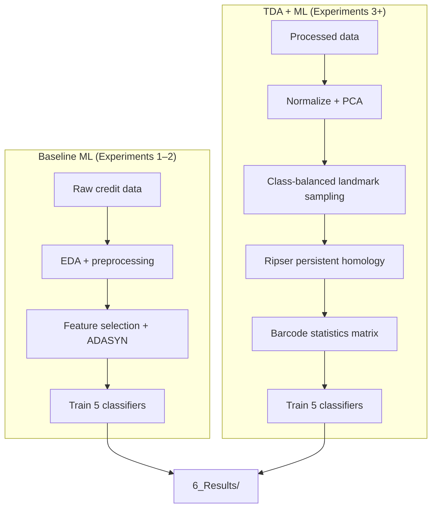

# Enhancing Loan Default Prediction Using Topological Data Analysis

Research codebase for investigating whether **Topological Data Analysis (TDA)**—specifically **persistent homology barcode statistics**—can improve credit default prediction compared to classical machine learning on raw tabular features.

The project compares baseline classifiers trained on original credit datasets against the same classifiers trained on TDA-derived feature matrices, across two public UCI datasets and a suite of controlled experiments (paper + exploratory + new methodology/statistics). Results feed into the thesis/paper *Enhancing Loan Default Prediction Using Topological Data Analysis* (`7_Paper/`).

---

## Table of Contents

- [Overview](#overview)
- [Research Questions](#research-questions)
- [Datasets](#datasets)
- [Methodology](#methodology)
- [Repository Structure](#repository-structure)
- [Experiments](#experiments)
- [Protocol buckets and later studies](#protocol-buckets-and-later-studies)
- [Machine Learning Setup](#machine-learning-setup)
- [Getting Started](#getting-started)
- [Running Experiments](#running-experiments)
- [Results and Paper Outputs](#results-and-paper-outputs)
- [Documentation for the Team](#documentation-for-the-team)
- [Core Utilities (`utils.py`)](#core-utilities-utilspy)
- [Known Issues](#known-issues)
- [What Is Not Tracked in Git](#what-is-not-tracked-in-git)

---

## Overview

Credit default prediction is typically approached as supervised classification on engineered tabular features. This project adds a **topological feature engineering stage**:

1. Reduce and normalize the original dataset (PCA).
2. Sample **landmark subsets** from each class.
3. Compute **persistence diagrams** with Ripser.
4. Summarize each diagram into **12 barcode statistics** per homology dimension (H₀, H₁).
5. Train standard ML classifiers on the resulting barcode feature matrix.

The pipeline is implemented in **`utils.py`** (~2,500 lines) and orchestrated through **protocol buckets** under **`5_Experiments/`**. Aggregated metrics and LaTeX tables are produced in **`6_Results/`**. Folder map: `docs/Repository_Layout.md`.



---

## Research Questions

The experiments systematically address:

| Theme | Question |
|-------|----------|
| **Baseline comparison** | How do default vs. tuned ML models perform on original features? (Exp 1–2) |
| **TDA value** | Do barcode statistics match or exceed baseline performance? (Exp 3–4) |
| **Homology choice** | Does restricting to H₀-only barcodes hurt performance? (Exp 6) |
| **Feature redundancy** | Can dropping correlated barcode columns improve models? (Exp 11) |
| **Fair comparison** | When sample sizes or PCA variance are matched across datasets, do conclusions hold? (Exp 12–13) |
| **Class imbalance** | How do models behave under imbalanced landmark sampling? (Exp 14) |
| **Linearity** | Can a simple linear boundary separate classes in barcode space? (Exp 19) |

Exploratory experiments (Mapper, PCA/t-SNE/UMAP visualizations, KNN sweeps, covariance analysis) support interpretation but are **not** included in the main paper results.

---

## Datasets

Six datasets share the mirrored folder names across `1_Data/`, `5_Experiments/`, and `6_Results/`:

| Dataset | Folder | Raw source | Default target | Snapshot size as percent of the class | Why those percents |
|---------|--------|------------|----------------|----------------------------------------|--------------------|
| **Default of Credit Card Client** (DCCCD) | `Default_Of_Credit_Card_Client_Data/` | `default of credit card clients.xls` | `default payment next month` | **5%**, **15%** | Original paper. Minority class count = 6630, so 5% is already 331 points per snapshot. |
| **Statlog German Credit** (SGCD) | `Statlog_German_Credit_Data/` | `german.data-numeric` | Class label (mapped to binary) | **30%**, **60%** | Original paper. Minority class count = 300, so large percents are required for a usable cloud. |
| **PKDD'99 Czech Financial** | `PKDD_Czech_Financial/` | `*.asc` (loan/trans/…) | `target` | **10%**, **20%** | Shared new-table grid. 5% of 76 minority rows is 3 points (PH dies). |
| **Polish Bankruptcy (3-year)** | `Polish_Bankruptcy_3Year/` | `3year.arff` | `target` | **10%**, **20%** | Same grid so the four new tables stay comparable. |
| **Taiwan Bankruptcy** | `Taiwan_Bankruptcy/` | `data.csv` | `target` | **10%**, **20%** | Same grid. 20% is the 2× companion (as Statlog 30→60). |
| **South German Credit** | `South_German_Credit/` | `SouthGermanCredit.asc` | `target` | **10%**, **20%** | Coding-sensitivity table — *not* Statlog’s 30/60, so coding is not confounded with snapshot size. |

Why 10%/20% is not a copy of either paper grid: `docs/Design_Decisions.md`. See `docs/Notation.md` for the symbol mapping used in the methods literature.

Raw files live under `1_Data/Datasets/{Folder}/`.

### Dataset-specific preprocessing defaults

| Setting | DCCCD | SGCD | Four new tables |
|---------|-------|------|-----------------|
| PCA components in Exp 3 | 7 (~94% variance) | 15 (~89% variance) | **10** (shared Ripser box; target was ~90%, Taiwan ~88%, others miss — see `docs/Design_Decisions.md`) |
| Landmark files per percentage | 500 (balanced across classes) | 500 | 500 |
| Homology dimensions | H₀ + H₁ (`dim=2`) unless noted | H₀ + H₁ | H₀ + H₁ |
| Class balancing (TDA stage) | Undersample majority to minority count | Same | Same |

Processed tables (`processed_data.xlsx` for legacy; `processed_data.csv` for registry datasets) live under `1_Data/Processed_Datasets/{Folder}/` and are consumed by later experiments.

---

## Methodology

### Baseline pipeline (Experiments 1–2)

1. **Exploratory Data Analysis** — custom `eda()` summaries + YData Profiling HTML reports.
2. **Preprocessing** — `data_preprocessing_pipeline()` handles cleaning and encoding.
3. **Feature selection** — `SelectFpr` (ANOVA F-test).
4. **Resampling** — ADASYN on the training set.
5. **Scaling** — `MinMaxScaler`.
6. **Split** — 80/20 stratified train/test (`random_state=0`).
7. **Modeling** — five classifiers with default (Exp 1) or GridSearchCV-tuned (Exp 2) hyperparameters.

### TDA pipeline (Experiments 3+)

1. Load `processed_data.xlsx`.
2. **Normalize** with `MinMaxScaler`, then **PCA** (dataset-specific component count).
3. **Split by class** and balance by undersampling the majority class.
4. **`generate_landmark_sets()`** — for each class and landmark percentage, draw `n_files` random landmark subsets and save CSVs to `1_Data/Landmark_Sets/`.
5. **`compute_barcodes_from_multiple_landmarks()`** — run **Ripser** on each landmark set; compute persistence diagrams.
6. **`compute_barcode_statistics()`** — summarize each diagram into 12 statistics (mean/median/std of birth, death, persistence, gap-to-max-death).
7. **`build_final_barcode_statistics_data()`** — merge class-wise barcode CSVs into `data_L{percent}.csv` in `1_Data/TDA_Datasets/`.
8. **Train classifiers** on barcode features; store metrics in `6_Results/{Bucket}/{Experiment}/{Dataset}/`.

### Barcode feature columns

Each homology dimension contributes 12 features (`g1`–`g12`), named `g{i}_{dim}` in CSV files:

| Code | Statistic |
|------|-----------|
| g1–g4 | Mean birth, death, persistence, gap to max death |
| g5–g8 | Median birth, death, persistence, gap to max death |
| g9–g12 | Std birth, death, persistence, gap to max death |

With `dim=2`, the final feature matrix has **24 topological features + label** (H₀ and H₁). Descriptive names are applied via `rename_barcode_statistics_columns()` and documented in `COLUMN_DESCRIPTIONS` inside `utils.py`.

---

## Repository Structure

```
Enhancing_Loan_Default_Prediction_Using_TDA/
├── utils.py                          # Shared library (EDA, TDA, ML, visualization)
├── Experiment Report.txt             # Paper vs. exploratory experiment index
├── 1_Data/
│   ├── Datasets/                     # Raw UCI files (tracked)
│   ├── Processed_Datasets/           # Cleaned splits (generated; gitignored)
│   ├── Landmark_Sets/                # Sampled point clouds (generated; gitignored)
│   ├── Barcode_Statistics/           # Per-class PH summaries (generated; gitignored)
│   ├── TDA_Datasets/                 # Merged barcode ML matrices (generated; gitignored)
│   └── data.py                       # Convenience CSV loaders
├── 2_Pandas_Profiling_Report/        # HTML EDA reports (generated; gitignored)
├── 3_Python_Objects/                 # EDA workbooks, serialized objects (gitignored)
├── 4_Visualization/                  # Figures, system diagrams, Mapper recordings
├── 5_Experiments/                    # Protocol buckets (see 5_Experiments/README.md)
├── 6_Results/                        # Same bucket tree as 5_Experiments/
└── 7_Paper/                          # Thesis PDF, LaTeX template, proposal, literature
```

Top-level buckets under both `5_Experiments/` and `6_Results/`: `Default_Parameters/`, the eight TDA processes (`Early_Split_And_Undersample_H0/`, `Early_Split_And_Undersample_H0_And_H1/`, `Early_Split_No_Undersample_H0/`, `Early_Split_No_Undersample_H0_And_H1/`, `Late_Split_And_Undersample_H0/`, `Late_Split_And_Undersample_H0_And_H1/`, `Late_Split_No_Undersample_H0/`, `Late_Split_No_Undersample_H0_And_H1/`), `Statistics/`, `Snapshot_Sample_Size/`, `Archives/`. Numbered experiments live *inside* a bucket. TDA artefacts are mirrored at `1_Data/{TDA_Datasets,Landmark_Sets,Barcode_Statistics}/{ProtocolBucket}/{ExperimentName}/{Dataset}/`. `1_Data/Processed_Datasets/` is shared and is not re-bucketed. Public process names always use “and”, never “+”; see `utils.process_display_name()`.

---

## Experiments

Numbered experiments live **inside** protocol buckets under `5_Experiments/` (mirrored in `6_Results/`). See `5_Experiments/README.md`.

Each dataset folder contains the method script (for PH default that is `*_PH.py`; tuned uses `*_PH_tuned.py`; H0-only uses `*_H0_only.py`). Every **active** experiment folder also has `visualize_results.py` at the experiment root.

### Experiments used in the research paper

These ten folder-level experiments are aggregated by `6_Results/results.py` as **Paper Experiments 1–10** (tables land in `6_Results/Paper_Tables/`):

| Paper # | Folder | Name | Description | Datasets |
|---------|--------|------|-------------|----------|
| 1 | `Default_Parameters/1_ML_Default_Parameters` | ML baseline (default params) | Classifiers on **original** features, default hyperparameters | Both |
| 2 | `Default_Parameters/2_ML_Tuned_Parameters` | ML baseline (tuned) | GridSearchCV on original features | Both |
| 3 | `Late_Split_And_Undersample_H0_And_H1/1_PH_Default_Parameters` | TDA and ML (default params) | Full PH pipeline → classifiers with default params | Both |
| 4 | `Late_Split_And_Undersample_H0_And_H1/2_PH_Tuned_Parameters` | TDA and ML (tuned) | Consumes Exp 3 barcodes → GridSearchCV | Both |
| 5 | `Late_Split_And_Undersample_H0/1_PH_Default_Parameters` | H0-only barcodes | Same as Exp 3 but H0 columns only | Both |
| 6 | `Archives/Four_Arm_Nested_Experiments/Historical_Late_Split_Balanced_TDA/4_Dropping_Correlated_Barcode_Statistics_Columns` | Correlation filtering | Drop correlated barcode columns (threshold 0.80) before training | Both |
| 7 | `Archives/12_Equivalent_Sample_Size_For_Each_Dataset` | Matched sample size | DCCCD landmarks at **1.36% / 2.71%** to match SGCD L30/L60 counts | DCCCD only |
| 8 | `Archives/13_Similar_Variance_Retained_After_PCA` | Matched PCA variance | DCCCD with **5 PCA components** (~89% variance, matching SGCD) | DCCCD only |
| 9 | `Archives/14_Mixed_Classes_Training_With_Imbalanced_Datasets` | Imbalanced landmarks | 200 default vs. 800 non-default landmark files per class | Both |
| 10 | `Archives/Four_Arm_Nested_Experiments/Historical_Late_Split_Balanced_TDA/5_Linear_Regression_For_Prediction` | Linear separability | `LinearRegression` + 0.5 threshold instead of classifiers | Both |

> **Note:** Paper experiment numbers in `6_Results/results.py` differ from historical folder numbers for experiments 5–10. `results.py` re-labels them sequentially for LaTeX tables written to `6_Results/Paper_Tables/`.

### Exploratory experiments (archived; not in main paper tables)

| Folder | Purpose |
|--------|---------|
| `Archives/5_Mapper` | Kepler Mapper on **original** features (interactive HTML graphs) |
| `Archives/7_EDA_Barcode_Statistics` | EDA of barcode statistics from Experiments 3 and 6 |
| `Archives/8_Dimensionality_Reduction_On_Barcode_Statistics` | PCA scree plots and 2D scatter on barcode data |
| `Archives/9_Dimensionality_Reduction_On_Original_Dataset` | PCA on processed original data |
| `Archives/10_Covariance_Matrix_And_Distances` | Centroid-based distance analysis (mean / farthest / random) |
| `Archives/15_Working_With_K_in_KNN` | KNN elbow curve for k = 1…20 on barcode features |
| `Archives/16_Variance_Retained_for_Default_of_Credit_Card_Client_Dataset` | PCA component sweep on DCCCD |
| `Archives/17_Distribution_For_Each_Class` | PCA, t-SNE, UMAP class separability plots (2D/3D, animated) |
| `Archives/18_Variance_Retained_for_Statlog_German_Credit_Dataset` | PCA component sweep on SGCD |
| `Archives/20_Deep_Learning_For_Prediction` | **Placeholder** — not implemented (see [Known Issues](#known-issues)) |
| `Archives/21_Visualizing_Data_Shape_For_Barcode_Statistics_Using_TDA` | Kepler Mapper on barcode statistics |
| `Archives/22_Visualizing_Persistence_Diagrams` | Persistence diagram plots per class (Ripser + persim) |

---

## Protocol buckets and later studies

These address **train/test leakage** and the statistical checklist from the team discussion (Robinson & Turner arXiv:1310.7467; Chazal et al. arXiv:1406.1901; Frontiers survey §6.3.1). Historical checklist numbers 23–28 are **not** live folders at the root of `5_Experiments/`. Map: `docs/Repository_Layout.md`.

| Historical # | Live folder | Purpose | Status |
|---|--------|---------|--------|
| 23 | `Early_Split_And_Undersample_H0_And_H1/1_PH_Default_Parameters` | Stratified 80/20 **before** PCA/landmarks; still undersample inside each split | DCCCD + Statlog reused; other four need Ripser |
| 24 | `{H0-and-H1 process}/6_Sampling_Ratio_Audit` | Audit class counts, points per snapshot, number of snapshots, and the reuse ratio | **Ran** on the historical late-split-and-undersample process — reuse ≫ 1 with 500 snapshots |
| 25 | `Archives/Four_Arm_Nested_Experiments/{old arm}/7_Snapshot_Mean_Variance` | Mean/variance of barcode columns; landscape-mean proxy | Archived nested extra |
| 26 | `Statistics/1_Intrinsic_Dimension_Estimation` | Two-NN + Levina–Bickel for intrinsic dimension | **Ran** (protocol-independent) |
| 27 | `{process}/8_Null_Hypothesis_Algorithm2` | Permutation test with `F_{p,q}` (barcode-vector proxy) | **Ran** on the historical process — p≈0.005 |
| 28 | `{H0-and-H1 process}/9_Revised_Snapshot_Protocol` | Fixed points per snapshot, default 60 training snapshots / 15 test snapshots, reuse/overlap | Canonical early-split, no undersample, using both H0 and H1 |
| — | `Snapshot_Sample_Size/` | Dated 13/08/2026. Items 1, 2, and 4 (item 3 is this study, not a third grid) | Queue: `6_Results/Run_Queue/_snapshot_sample_size_queue.py`. Narrative: `5_Experiments/Snapshot_Sample_Size/README.md` |

Active TDA set inside every arm is 1–9. Tabular Experiment 2 stays under `Default_Parameters/`. Arm experiment 9 is **not** archived.

Details: `docs/Pipeline_Issues_And_Leakage.md`, `docs/Statistical_Experiments_24_27_Results.md`, `docs/Revised_Snapshot_Protocol_Deep_Report.md`.

---

## Machine Learning Setup

### Classifiers (used in both baseline and TDA experiments)

| Key | Model | Library |
|-----|-------|---------|
| `svm` | Support Vector Classifier | scikit-learn |
| `knn` | K-Nearest Neighbors | scikit-learn |
| `xgb` | XGBoost | xgboost |
| `logistic` | Logistic Regression | scikit-learn |
| `random_forest` | Random Forest | scikit-learn |

Arm experiment 5 / paper experiment 10 replaces these with **Linear Regression** (`train_dataset_tda_linear_regression`).

### Evaluation metrics

All classification experiments report:

- **Accuracy**
- **Precision**
- **Recall**
- **F1-score**
- Confusion matrix and classification report (stored in pickle objects)

Hyperparameter tuning (Experiments 2 and 4) uses **5-fold stratified cross-validation** with **F1** as the scoring metric.

### Typical TDA experiment script layout

Most PH experiments follow the structure in `5_Experiments/Late_Split_And_Undersample_H0_And_H1/1_PH_Default_Parameters/`:

```
1. Load processed_data.xlsx
2. PCA + class balancing
3. generate_landmark_sets(...)
4. compute_barcodes_from_multiple_landmarks(...)
5. build_final_barcode_statistics_data(...)
6. train_multiple_dataset_tda(...) or train_models_on_multiple_datasets(...)
7. store_results(...) → 6_Results/{Bucket}/{Experiment}/{Dataset}/model_results.pkl
8. (Optional) *_CV.py → CV_results.pkl  (DCCCD/Statlog historical companions)
9. visualize_results.py → 6_Results/{Bucket}/{Experiment}/Visualizations/
```

---

## Getting Started

### Prerequisites

- **Python 3.11+** recommended (project developed with a local `tda_env` virtual environment)
- Sufficient disk space for generated artifacts (**~7 GB** if all landmark/barcode data is regenerated)

### Environment setup

```powershell
# From the repository root
python -m venv tda_env
.\tda_env\Scripts\Activate.ps1
pip install --upgrade pip
```

Install core dependencies (versions from the project's `tda_env`):

```powershell
pip install numpy pandas scikit-learn xgboost imbalanced-learn joblib openpyxl xlsxwriter
pip install matplotlib seaborn plotly pyvis networkx
pip install ripser persim kmapper umap-learn
pip install ydata-profiling
```

### Important: dataset scripts insert the repo root

Newer dataset scripts add the repository root to `sys.path` and write artefacts through `utils.py` helpers. Running from the dataset folder still works:

```powershell
cd "5_Experiments\Late_Split_And_Undersample_H0_And_H1\1_PH_Default_Parameters\Default_Of_Credit_Card_Client_Data"
python default_of_credit_cards_client_PH.py
```

---

## Running Experiments

### Recommended order

Because later experiments depend on earlier outputs, run in this order:

| Step | Script(s) | Produces |
|------|-----------|----------|
| **1** | `5_Experiments/Default_Parameters/1_ML_Default_Parameters/{dataset}/*_data.py` | Processed splits, EDA artifacts, baseline `model_results.pkl` |
| **2** | `5_Experiments/Default_Parameters/2_ML_Tuned_Parameters/{dataset}/*_data.py` | Tuned baseline results |
| **3** | `5_Experiments/Late_Split_And_Undersample_H0_And_H1/1_PH_Default_Parameters/{dataset}/*_PH.py` | Landmark sets, barcode CSVs, TDA datasets, TDA model results |
| **4** | `5_Experiments/Late_Split_And_Undersample_H0_And_H1/2_PH_Tuned_Parameters/{dataset}/*_PH_tuned.py` | Tuned TDA results |
| **5+** | Remaining experiment scripts | Variants and analyses (many consume Historical Exp 1 outputs) |

### Cross-validation companions

Most ML/TDA experiments on Default of Credit Card Client and Statlog have a `*_CV.py` sibling that loads `model_results.pkl` and writes `CV_results.pkl` via `perform_cross_validation_tda()`. The other four datasets do not carry that companion; it is not the method document.

### Visualization

Every active experiment folder (`Default_Parameters` Exp 1–2, all four TDA arms Exp 1–9, and `Statistics/1_Intrinsic_Dimension_Estimation`) has `visualize_results.py` at the experiment root. Run that script; figures land only in `6_Results/{Bucket}/{Experiment}/Visualizations/`. Pickle/CSV experiments write per-dataset test dashboards and cross-dataset metric facets (plus CV figures when `CV_results.pkl` exists). Exp 6–9 and intrinsic dimension plot their CSV/JSON artefacts. The catalog is in `6_Results/README.md`. If artefacts are missing, the script exits with `results not generated yet` and the expected path.

### Regenerating all paper tables

After experiment pickles exist under `6_Results/`:

```powershell
cd 6_Results
python results.py
```

This loads all paper experiment results, builds summary DataFrames via `build_results_dataframe_v3()`, and writes into `Paper_Tables/`:

- `Paper_Tables/clean_experiment_results.csv`
- `Paper_Tables/results_table.tex`, `Paper_Tables/default_of_credit_card_client_results_table.tex`, `Paper_Tables/statlog_german_credit_results_table.tex`
- `Paper_Tables/results_experiment_1.tex` … `Paper_Tables/results_experiment_10.tex`

---

## Results and Paper Outputs

| Location | Contents |
|----------|----------|
| `6_Results/Paper_Tables/clean_experiment_results.csv` | Flat summary of key experiment metrics |
| `6_Results/Paper_Tables/*.tex` | LaTeX tables for the VGTC paper template |
| `6_Results/{Bucket}/{Experiment}/` | Per-experiment pickles, plots, Mapper HTML, GIFs |
| `6_Results/Run_Queue/` | Ripser/consumer queue scripts, logs, and run registries |
| `6_Results/results.py` | Documented paper-table aggregator (writes into `Paper_Tables/`) |
| `4_Visualization/` | Curated EDA figures, TDA concept diagrams, LucidChart system designs |
| `7_Paper/Enhancing_Loan_Default_Prediction_Using_Topological_Data_Analysis.pdf` | Final thesis/paper PDF |
| `7_Paper/Latex Template/` | VGTC conference LaTeX template |
| `Experiment Report.txt` | Quick index of paper vs. exploratory / new experiments |

## Documentation for the Team

| Document | Contents |
|----------|----------|
| `docs/Repository_Layout.md` | Buckets, method scripts, figures, barcodes, paper tables, queues |
| `docs/Notation.md` | Snapshot glossary: English names used in this study, and the t/l mapping from the methods literature |
| `docs/Design_Decisions.md` | **Why** 10%/20% snapshot size, why PCA 7 vs 15 vs 10, why ID before *and* after PCA |
| `docs/Statistical_Approach_Flow.md` | Stage-by-stage: Historical Exp 1 → arm Exp 6 → Statistics Exp 1 → arm Exp 7 → arm Exp 8 → arm Exp 9 → Snapshot_Sample_Size |
| `docs/Statistical_Experiments_24_27_Results.md` | Sampling / ID / NHST worked numbers (all six datasets) |
| `docs/Methodology_Checklist_06_08_2026.md` | scikit-dimension / dadapy / H0-split / snapshots — done vs skipped |
| `docs/Pipeline_Issues_And_Leakage.md` | Leakage analysis, statistical gaps, engineering status |
| `docs/CV_Results.md` | K-fold means, fold scores, vs hold-out |
| `docs/Exploratory_Experiments_Team_Report.md` | Exploratory experiment narrative (Archives) |
| `docs/Experiment_23_Results.md` | Early Split TDA Exp 1 / Protocol B hold-out numbers |
| `docs/Revised_Snapshot_Protocol_Deep_Report.md` | Arm experiment 9 protocol report (all six datasets, all four arms) |
| `5_Experiments/Snapshot_Sample_Size/README.md` | Dated sample-size study (items 1, 2, and 4) |

---

## Core Utilities (`utils.py`)

| Category | Functions |
|----------|-----------|
| **Preprocessing / EDA** | `eda`, `data_preprocessing_pipeline`, `fix_string` |
| **Landmarks & persistence homology** | `select_landmarks`, `generate_landmark_sets`, `generate_landmark_sets_v2`, `compute_barcode_statistics`, `compute_barcodes_from_multiple_landmarks`, `create_barcode_statistics`, `build_final_barcode_statistics_data` |
| **ML training** | `train_dataset`, `train_dataset_tda`, `train_multiple_dataset_tda`, `train_models_on_dataset`, `train_models_on_multiple_datasets`, `train_multiple_dataset_tda_drop_correlated`, `train_multiple_dataset_tda_linear_regression`, `train_multiple_knn_datasets`, `train_dataset_tda_presplit`, `train_models_on_presplit_dataset` |
| **Early-split / stats** | `stratified_early_split`, `fit_scaler_pca_on_train`, `balance_binary_by_undersampling`, `compute_sampling_ratio_audit`, `summarize_snapshot_statistics`, `estimate_intrinsic_dimension_two_nn`, `estimate_intrinsic_dimension_levina_bickel`, `estimate_intrinsic_dimension_skdim`, `estimate_intrinsic_dimension_suite`, `n_components_for_target_variance`, `permutation_test_algorithm2` |
| **Cross-validation** | `perform_cross_validation_tda` |
| **Analysis sweeps** | `run_experiments_with_pca_components`, `plot_all_metrics_vs_pca_components` |
| **Feature engineering** | `drop_correlated_features`, `rename_barcode_statistics_columns` |
| **Visualization** | `perform_pca_analysis`, `visualize_class_separability`, `visualize_correlation_drop_maps`, `build_mapper_viz`, `get_distance_view`, `improved_visualize_model_results`, `visualize_cross_validation_detailed` |
| **Persistence** | `store_results`, `store_data_as_csv_or_json`, `build_results_dataframe_v3` |

---

## Known Issues

| Item | Detail |
|------|--------|
| **Experiment 20** | Deep learning placeholder (no TensorFlow/PyTorch/Keras). Out of scope. |
| **Experiment 5 (Statlog)** | `Full_Feature_Set_With_Mapper` and `Balanced_Dataset_With_Mapper` raise `NotImplementedError` placeholders. Feature_Selection arm exists; DCCCD + registry Mapper scripts are the working references. |
| **Generated data not in Git** | Landmark sets, barcode CSVs, pickles, and HTML outputs are gitignored. Clone + run experiments to reproduce. |

See also `docs/Pipeline_Issues_And_Leakage.md` for leakage / statistical caveats.

---

## What Is Not Tracked in Git

See `.gitignore`. In summary, the following are **excluded** from version control because they are large and/or regeneratable:

- `tda_env/` — virtual environment
- `1_Data/Landmark_Sets/`, `Barcode_Statistics/`, `TDA_Datasets/`, `Processed_Datasets/`
- `2_Pandas_Profiling_Report/`, `3_Python_Objects/`
- `*.pkl`, `*.joblib`, `*.html` (experiment outputs)
- Most generated plots/CSVs/JSON under `6_Results/` (except `Paper_Tables/clean_experiment_results.csv`)
- KeplerMapper `parameters.txt` dumps and `6_Results/Archives/5_Mapper/`
- `4_Visualization/Visualization/` bulk figure exports
- `7_Paper/Datasets/` and literature PDFs

**Tracked** content includes: Python source, raw UCI datasets, curated visualization assets, LaTeX tables, and the thesis PDF.

---

## Four-dataset extension (2026)

Four additional datasets share the same mirrored layout as the legacy pair
(`5_Experiments/{Bucket}/{Experiment}/{Folder}/` ↔ `6_Results/{Bucket}/{Experiment}/{Folder}/` ↔ `1_Data/.../{Folder}/`):

| Dataset | Folder under `1_Data/Datasets/` |
|---------|----------------------------------|
| PKDD'99 Czech Financial | `PKDD_Czech_Financial/` |
| Polish Companies Bankruptcy (3-year) | `Polish_Bankruptcy_3Year/` |
| Taiwanese Bankruptcy Prediction | `Taiwan_Bankruptcy/` |
| South German Credit | `South_German_Credit/` |

Processed tables live in `1_Data/Processed_Datasets/{Folder}/`.

Layout: `5_Experiments/{Bucket}/{Experiment}/{Folder}/` ↔ `6_Results/{Bucket}/{Experiment}/{Folder}/` ↔ `1_Data/.../{ProtocolBucket}/{Experiment}/{Folder}/`. There is no `5_Experiments/common/pipeline.py`; shared helpers are `utils.py`.

```
5_Experiments/Default_Parameters/1_ML_Default_Parameters/PKDD_Czech_Financial/pkdd_czech_financial.py
5_Experiments/Late_Split_And_Undersample_H0_And_H1/1_PH_Default_Parameters/PKDD_Czech_Financial/pkdd_czech_financial_PH.py
6_Results/Default_Parameters/1_ML_Default_Parameters/PKDD_Czech_Financial/baseline_results.csv
```

Shared helpers are the same **`utils.py`** used by Statlog / DCCCD.
Raw→processed ingestion for the four registry datasets is
`1_Data/ingest_registry_datasets.py`.

```powershell
.\tda_env\Scripts\python.exe 1_Data\ingest_registry_datasets.py
.\tda_env\Scripts\python.exe 5_Experiments\Default_Parameters\1_ML_Default_Parameters\PKDD_Czech_Financial\pkdd_czech_financial.py
.\tda_env\Scripts\python.exe -m pytest test_datasets.py -q
```

Mirror checksums are verified against `1_Data/Datasets/MANIFEST.csv`;
primary-source and licence verification remain required before publication.

---

## Citation

If you use this code or methodology, please cite the associated thesis:

> **Enhancing Loan Default Prediction Using Topological Data Analysis**  
> Leonard Onyiriuba — Individual Project, 2025

---

## Author

**Leonard Onyiriuba**

Project proposal and paper materials: `7_Paper/Project Proposal/`
